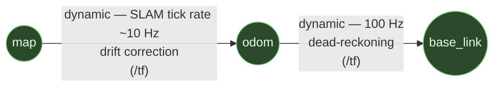

# Autonomy pipeline

End-to-end overview of the autonomy stack: from raw LiDAR/IMU coming out of UE5 through perception, SLAM, path planning, and control — and back to UE5 as a `ControlCommand`. Read this before touching any of the autonomy nodes.

For sim-side topics (sensors, vehicle physics, RPC) see [`REFERENCE.md`](REFERENCE.md). For container layout and how to launch the stack see [`SETUP.md`](SETUP.md) (first-time) and [`OPERATING.md`](OPERATING.md) (daily ops).

The DV pipeline (perception, SLAM, path planning, control, mission management) lives in a separate repo and is attached here as a submodule. The point of the split is that **the same code runs on the real car and in sim** — IFSSIM owns everything that fakes the real-car environment for it (sim, sim ↔ ROS bridge, Mission Control web, visualisation, Docker glue), and the autonomy submodule sees the same ROS interface either way. This is the central organising principle of the architecture and shows up in every section below.

## Component ownership

| Side | Owner | Lives in |
|---|---|---|
| Sim (UE5 + FSDSPlugin) | IFSSIM | this repo, `Plugins/FSDSPlugin/` |
| Sim ↔ ROS bridge | IFSSIM | this repo, `ros2/src/ifssim_bridge/` |
| Mission Control web (frontend + backend) | IFSSIM | this repo, `tools/mission_control/` |
| Visualisation (Lichtblick + layouts) | IFSSIM | this repo, `lichtblick/`, container `lichtblick` |
| Mission management (`sim_supervisor`, `mission_control`, `mode_manager`, `node_base`) | DV pipeline | submodule |
| Autonomy lifecycle nodes (`cone_detection`, `slam`, `path_planning`, `control`, `odometry_filter_node`) | DV pipeline | submodule |
| `coche_urdf` + `robot_state_publisher` | DV pipeline | submodule |
| Docker / compose / launch glue | IFSSIM | this repo, `docker/` |

### Roles inside mission management

- **`sim_supervisor_node`** simulates the role the IFS-08 uDV (the on-vehicle microcontroller) plays on the real car. In sim it sources the `GO` signal, sinks the `FINISHED` signal, and relays `RuntimeControl` feedback onto `/fsds/control_command` for the bridge. On the real car the physical uDV plays that role over microROS/USB-CDC. This node only exists in sim.
- **`mission_control_node`** is the action server for the **two-phase runtime protocol** (`SetMission` for prepare/configure, `RuntimeControl` for activate/run). It drives the autonomy lifecycle through `mode_manager`, surfaces `/mode_manager/progress` per-node stages as `SetMission` `Feedback`, and forwards control commands from the autonomy stack to the supervisor (in sim) or to the uDV over USB CDC running microROS (real car). Because the uDV is a microROS endpoint, the DVPC↔uDV exchange is **already a ROS 2 client-server interaction on the real car** — the only thing that changes between sim and real is the underlying DDS transport (intra-process in sim, USB-CDC-framed microROS in real).
- **`mode_manager_node`** owns `MODE_REGISTRY` (the single source of truth for `mission → ordered (node, behavior)` mapping, in `pipeline/mode_manager/mode_manager/mode_registry.py`). On `activate_mode`, it calls each node's `~/setup` service with `(mode_name, behavior)`, then drives the lifecycle transitions in registry order. `activate_mode` takes a two-phase flag (`activate=false` → configure only; `activate=true` → activate the already-prepared nodes), so prepare and run cleanly separate.
- **Autonomy lifecycle nodes** inherit `BaseLifecycleNode` (Python: `pipeline/node_base/`, C++: `pipeline/node_base_cpp/`), which provides the `~/setup` service plumbing and stores `mode_name` + `behavior` for subclass `on_configure` to pick its strategy. The five managed nodes are `odometry_filter_node`, `cone_detection_node`, `slam_node`, `path_planning_node`, `control_node` — same binary handles trackdrive / autocross / accel / skidpad / scruti with different inner behaviours (e.g. `control_node` selects `pure_pursuit` vs `stanley` from the behavior string).

`mission_control_node` and `sim_supervisor_node` are **always co-resident in sim** — the supervisor doesn't host the DVPC role itself. The autonomy stack's view of the world is therefore the same in sim and on the real car: identical ROS 2 client calls into a microROS endpoint, with only the underlying DDS transport differing. `mission_control_backend` (the web stack) targets `mission_control_node` directly via `SetMission` + `RuntimeControl`; the supervisor receives the throttle/steering stream as `RuntimeControl` `Feedback` and republishes onto the bridge.

Odometry lives inside `slam_node` (or in a thin fusion library it imports) rather than as a separate node — see [Open questions](#open-questions) for the exact placement decision, which has consequences for how DA degradation in cone-only sections is recoverable.

## End-to-end graph

The runtime control loop mirrors the real-car path: the autonomy stack does **not** publish actuator commands directly to the sim. `control_node` sends commands to `mission_control_node`, which forwards them to `sim_supervisor_node` (the simulated uDV), which publishes them to the bridge. On the real car the same `mission_control_node` forwards to the physical uDV over USB CDC running microROS — semantically identical ROS 2 client calls, only the transport changes. The sim path is one redirect longer than strictly necessary on purpose, so a bug in the chain shows up in sim before it shows up at the test track.

```mermaid
flowchart TB
    classDef sim fill:#1f3a52,stroke:#5fa3d6,color:#e8f0ff
    classDef bridge fill:#3a2a52,stroke:#a778d6,color:#f0e8ff
    classDef mc fill:#52382a,stroke:#d6925f,color:#ffe8d8
    classDef miss fill:#523a52,stroke:#d678d6,color:#ffe8ff
    classDef autn fill:#2a4a2a,stroke:#7dc97d,color:#e8ffe8
    classDef infra fill:#3a3a3a,stroke:#a8a8a8,color:#e8e8e8
    classDef viz fill:#3a3a3a,stroke:#a8a8a8,color:#e8e8e8,stroke-dasharray:4 4

    %% =====================================================================
    %% IFSSIM-OWNED HALF
    %% =====================================================================
    subgraph UE5["IFSSIM (host) — owned by this repo"]
        plugin["<b>FSDSPlugin</b><br/><i>C++</i><br/>RPC server :41451<br/>UDP sensor push"]
    end
    class UE5 sim

    subgraph BridgeContainer["🐳 ifssim_bridge_stack — owned by this repo"]
        bridge["<b>ifssim_bridge</b><br/><i>C++</i><br/>UDP recv + JSON-RPC<br/>publishes /fsds/* topics<br/>subscribes /fsds/control_command"]
    end
    class bridge bridge

    subgraph MCWeb["🐳 mission_control_(frontend|backend) — owned by this repo"]
        mc_frontend["<b>frontend</b> (React)"]
        mc_backend["<b>backend</b> (FastAPI)"]
    end
    class mc_frontend,mc_backend mc

    subgraph VizContainer["🐳 lichtblick — owned by this repo"]
        fox["<b>foxglove_bridge</b><br/>ws://:8765"]
    end
    class fox,VizContainer viz

    %% =====================================================================
    %% DV PIPELINE SUBMODULE
    %% =====================================================================
    subgraph PipelineSubmodule["🐳 dv_pipeline_stack — DV pipeline submodule"]

        subgraph Mission["Mission management"]
            sup["<b>sim_supervisor_node</b><br/>(sim-only)<br/>simulates uDV (microROS endpoint)"]
            mcn["<b>mission_control_node</b>"]
            mm["<b>mode_manager_node</b><br/>lifecycle orchestrator"]
        end
        class sup,mcn,mm miss

        subgraph Auton["Autonomy pipeline (BaseLifecycleNodes)"]
            of["<b>odometry_filter_node</b><br/><i>C++ — node_base_cpp</i><br/>100 Hz /odom + odom→base_link TF"]
            cd["<b>cone_detection_node</b><br/><i>perception pkg</i>"]
            slam["<b>slam_node</b><br/><i>cone_slam pkg</i>"]
            plan["<b>path_planning_node</b>"]
            ctrl["<b>control_node</b><br/>40 Hz timer<br/>(slew-limited, PR #308)"]
        end
        class of,cd,slam,plan,ctrl autn

        subgraph Infra["Infrastructure"]
            rsp["<b>robot_state_publisher</b><br/>+ joint_state_publisher<br/>coche_urdf, 200 Hz TF"]
        end
        class rsp infra
    end

    %% =====================================================================
    %% SIM SENSORS: bridge → submodule
    %% =====================================================================
    plugin -- "UDP :51453 (LiDAR)<br/>UDP :41452 (other sensors)" --> bridge
    bridge -- "<b>/fsds/lidar/Lidar1</b><br/>PointCloud2 @ 10 Hz" --> cd
    bridge -- "<b>/fsds/imu</b><br/>sensor_msgs/Imu @ 400 Hz" --> slam
    bridge -- "<b>/fsds/motor_rpm</b><br/>Float32 @ 80 Hz<br/>(velocity prior)" --> slam
    bridge -- "<b>/fsds/testing_only/odom</b><br/>(diagnostic only — GT-aligned)" --> slam
    bridge -- "<b>/fsds/imu</b><br/>(filter prediction)" --> of
    bridge -- "<b>/fsds/motor_rpm</b><br/>(filter correction)" --> of
    bridge -- "<b>/fsds/steering_angle</b><br/>(kinematic-bicycle cross-check, #383)" --> of

    %% =====================================================================
    %% AUTONOMY DATAFLOW (internal to submodule)
    %% =====================================================================
    cd -- "/Conos_raw MarkerArray" --> slam
    slam -- "<b>/Conos MarkerArray</b><br/>(map frame)<br/>+ TF map→odom" --> plan
    slam -- "<b>/slam/pose</b><br/>(absolute pose, ~10 Hz, map frame)<br/>+ TF map→odom" --> ctrl
    of -- "<b>/odom</b><br/>nav_msgs/Odometry @ 100 Hz<br/>+ TF odom→base_link<br/>(IMU+RPM dead-reckoning)" --> ctrl
    of -. "<b>/odom</b><br/>(for map→odom drift correction)" .-> slam
    plan -- "<b>/Path</b><br/>(map frame)" --> ctrl
    rsp -. "TF (URDF joints + base)" .-> slam
    rsp -. "TF" .-> ctrl

    %% =====================================================================
    %% MISSION MANAGEMENT — STARTUP (Phase 1) and RUNTIME (Phase 2) ACTIONS
    %% =====================================================================
    mcn -- "activate_mode [Srv]<br/>(activate=false → prepare<br/>activate=true → run)" --> mm
    mm -- "<b>~/setup [Srv]</b><br/>(mode_name, behavior)" .-> of
    mm -. "~/setup" .-> cd
    mm -. "~/setup" .-> slam
    mm -. "~/setup" .-> plan
    mm -. "~/setup" .-> ctrl
    mm -. "change_state [Srv]<br/>(lifecycle)" .-> of
    mm -. "change_state" .-> cd
    mm -. "change_state" .-> slam
    mm -. "change_state" .-> plan
    mm -. "change_state" .-> ctrl
    sup -. "<b>RuntimeControl [Action] Feedback</b><br/>→ /fsds/control_command" .-> mcn
    ctrl -- "<b>/ctrl/cmd_internal</b><br/>fs_msgs/ControlCommand @ 40 Hz" --> mcn
    ctrl -- "<b>/ctrl/emergency</b><br/>std_msgs/Bool (latched)" --> mcn
    slam -- "<b>/slam/finished</b><br/>std_msgs/Bool (latched)" --> mcn

    %% =====================================================================
    %% SIM-SIDE OUTPUT: sim_supervisor → bridge → FSDS
    %% =====================================================================
    sup -- "<b>/fsds/control_command</b><br/>fs_msgs/ControlCommand<br/>(simulating uDV→bridge)" --> bridge
    sup -- "/signal/ebs, /signal/ebs_reset" --> bridge
    bridge -- "JSON-RPC :41451<br/>(throttle/regen/steer + EBS<br/>+ loadTrack/setMode/...)" --> plugin

    %% =====================================================================
    %% MISSION CONTROL WEB ↔ MISSION MANAGEMENT
    %% =====================================================================
    mc_frontend -- "REST" --> mc_backend
    mc_backend -- "<b>SetMission [Action]</b><br/>Phase 1 — prepare/configure<br/>(rclpy client)" --> mcn
    mc_backend -- "<b>RuntimeControl [Action]</b><br/>Phase 2 — activate+run<br/>(rclpy client)" --> mcn
    mc_backend -- "JSON-RPC<br/>(track load, sim pause, RES)" --> bridge

    %% =====================================================================
    %% VIZ
    %% =====================================================================
    bridge -. "all /fsds/*" .-> fox
    cd -. "/Conos_raw, /Conos_Orange" .-> fox
    slam -. "/Conos, /slam/pose, /cone_slam/gt_*, TF" .-> fox
    of -. "/odom" .-> fox
    plan -. "/Path, /path_planning/debug" .-> fox
    ctrl -. "/control/*" .-> fox
```

Solid arrows are ROS topics, RPC, or Action exchanges; dashed arrows are TF, services, or visualisation side-channels. Bidirectional `<-->` arrows represent ROS Actions (request + heartbeats + result).

Colour key: blue = sim, purple = bridge, orange = Mission Control web, magenta = mission management ROS nodes, green = autonomy lifecycle nodes, grey = infrastructure / viz.

## The integration contract

This is the API surface between IFSSIM and the DV pipeline submodule. **Any change here is a breaking interface change** and must be coordinated.

### Topics IFSSIM publishes (bridge → submodule)

All sensor topics are namespaced under `/fsds/...` — the prefix is what tells the submodule "this is a simulated sensor, not real hardware." On the real car these come from real driver nodes under different names; the bridge is what fakes the FSDS-namespaced surface in sim.

| Topic | Type | Frame | Rate | Notes |
|---|---|---|---|---|
| `/fsds/lidar/Lidar1` | `sensor_msgs/PointCloud2` | `fsds/Lidar` | 10 Hz | LiDAR point cloud — fields `x`, `y`, `z`, `intensity` (FLOAT32). Intensity follows the Hesai ATX-S01 working principle (ρ × cos(θ) × (R_ref/r)²); see [`REFERENCE.md`](REFERENCE.md) §4.1. |
| `/fsds/imu` | `sensor_msgs/Imu` | `fsds/IMU` | ~400 Hz | 6-DoF IMU. Consumed by `slam_node` (preintegration) AND `odometry_filter_node` (filter prediction step) post-feat/360. |
| `/fsds/motor_rpm` | `std_msgs/Float32` | — | ~80 Hz | Drive-axle RPM. Primary longitudinal velocity input — both `slam_node` (velocity prior) and `odometry_filter_node` (EKF correction step) consume it. The IFS-08 doesn't have GSS, so RPM + IMU + steering is the full real-car odometry input set. |
| `/fsds/steering_angle` | `std_msgs/Float32` | — | ~100 Hz | **Phase 3 (#383).** Front-wheel angle in radians, converted in the bridge from the plugin's normalized [-1, 1] axis input via `max_steering_angle_rad` (default 0.5). Consumed by `odometry_filter_node` for the kinematic-bicycle yaw cross-check (`ω_pred = (vx/L)·tan(δ)`); residual published on `/odom_diag/yaw_residual_rad_s`. |
| `/fsds/brake_pressure` | `std_msgs/Float32` | — | ~100 Hz | **Published but not consumed** by the autonomy stack post-EKF rewrite. Originally fed the complementary filter as a brake-event α_vx-scaling input; the EKF now relies on Kalman covariance gating instead, which handles wheel-lockup naturally without a brake-aware shim. Kept on the bridge for replay parity and future use. |
| `/fsds/gss` | `geometry_msgs/TwistWithCovarianceStamped` | `fsds/GSS` | ~100 Hz | **Published but not consumed.** The IFS-08 has no ground-speed sensor; the bridge keeps the topic for backward-compat with code that hasn't migrated yet. New consumers must not depend on it. |
| `/fsds/gps` | `sensor_msgs/NavSatFix` | `fsds/GPS` | ~10 Hz | **Published but not consumed.** Reserved for future global-localisation work (e.g. GPS-aligned `map` frame); no autonomy node subscribes today. |
| `/fsds/testing_only/odom` | `nav_msgs/Odometry` | `odom` (child `base_link`) | ~80 Hz | **Diagnostic only.** Ground-truth pose + clean body-frame velocity. Autonomy must not consume it on the production path; consumed only by the GT-as-SLAM diagnostic (`pipeline/cone_slam/scripts/gt_pose_relay.py`) and `slam_node`'s GT-aligned residual publisher (`/cone_slam/gt_aligned`, `/cone_slam/gt_error_m`). |

### Topics the submodule publishes back (sim_supervisor → bridge)

The submodule's autonomy stack does **not** publish actuator commands directly to the bridge. Commands flow through `mission_control_node` and `sim_supervisor_node` first, so the sim path matches the real-car `DVPC → uDV (microROS over USB CDC)` chain. The bridge only ever sees commands from `sim_supervisor_node`.

| Topic | Type | Publisher | Notes |
|---|---|---|---|
| `/fsds/control_command` | `fs_msgs/ControlCommand` | `sim_supervisor_node` | Throttle / regen / steering. The bridge subscribes; `control_node` does **not** publish here directly — its output flows through `/ctrl/cmd_internal` → RuntimeControl action → supervisor (#384). |
| `/signal/ebs` (latched) | `std_msgs/Empty` | `sim_supervisor_node` | EBS trigger. Latched on the rising edge of RuntimeControl `Feedback.emergency`. Post-#384 the autonomy never publishes here directly. |
| `/signal/ebs_reset` (latched) | `std_msgs/Empty` | `sim_supervisor_node` | EBS reset on supervisor activate (mirrors uDV power-up). Post-#384 the autonomy never publishes here directly. |

The bridge tolerates startup-time absence of `/fsds/control_command` until `RuntimeControl` is open and streaming feedback — actuator commands only start flowing after the autonomy lifecycle has fully come up and the supervisor has begun relaying feedback frames onto `/fsds/control_command`.

### Autonomy-internal actuator topics (control_node → mission_control_node)

These topics live inside the autonomy submodule and exist to drive the RuntimeControl action's Feedback frames. The supervisor never subscribes to them directly — `mission_control_node` aggregates them and surfaces them as RuntimeControl `Feedback` per tick.

| Topic | Type | Publisher | Subscriber | Notes |
|---|---|---|---|---|
| `/ctrl/cmd_internal` | `fs_msgs/ControlCommand` | `control_node` | `mission_control_node` | Per-tick throttle / steering / brake from the controller, 40 Hz. Renamed from `/control_command` in #384 so the bridge can never accidentally re-subscribe to the autonomy's pre-aggregation source. |
| `/ctrl/emergency` (latched) | `std_msgs/Bool` | `control_node` | `mission_control_node` | EBS request. `mission_control_node` surfaces a rising edge as `Feedback.emergency=true`; the supervisor then latches `/signal/ebs`. Default-false latched at controller activate so a late mcn subscription sees a defined state. |
| `/slam/finished` (latched) | `std_msgs/Bool` | `slam_node` | `mission_control_node` | Mission-completion signal. Surfaced as `Feedback.finished=true`; mission_control then terminates the RuntimeControl action with `outcome="finished"`. Currently a stub (always false) — wiring the actual lap-min-distance + big-orange detector to flip it is a follow-up. |

### Runtime action protocol (client → mission_control_node)

The control loop is a two-phase ROS Action protocol, both served by `mission_control_node`. The client is `mission_control_backend` (web UI) or `supervisor_cli` (terminal); the supervisor passively relays runtime feedback to the bridge.

**Phase 1 — `SetMission` (prepare).** Client sends an `int32 mission_id` from `MODE_REGISTRY` (1=trackdrive, 2=autocross, 3=accel, 4=skidpad, 5=scruti, 0=tear down). `mission_control_node` resolves the registry entry and calls `mode_manager.activate_mode(mission=<name>, activate=false)`. For each `(node, behavior)` tuple in registry order, `mode_manager` calls the node's `~/setup` service with `(mode_name, behavior)` then drives the `configure` transition. The `~/setup` call is what tells each `BaseLifecycleNode` which strategy to instantiate inside `on_configure` (`control_node` picks `pure_pursuit` vs `stanley`; `slam_node` / `path_planning_node` pick their mission-specific tunings).

`SetMission` `Feedback.stage` carries the per-node progress (`"slam_node set up"`, `"configuring path_planning_node"`, `"cone_detection_node configured"`, …) relayed from `/mode_manager/progress`. The configure phase is also where Numba JIT compile for `cone_detection_node` runs (~10-20 s on Apple Silicon Docker); the action's heartbeats absorb that window so the client can show live progress instead of an opaque "starting" wait. Result is `success=true/false` plus a per-node `message` on failure.

If the operator changes the mission during this window (e.g. switches accel → skidpad), the in-flight goal is cancellable and a fresh `SetMission` for the new mission tears down and re-prepares cleanly. `mission_id=0` (or `mission=""` to `activate_mode`) deactivates + cleans up every autonomy node.

**Phase 2 — `RuntimeControl` (activate + run).** Once `SetMission` succeeds, the client opens `RuntimeControl` against `mission_control_node`. `mission_control_node` first calls `mode_manager.activate_mode(mission=<name>, activate=true)` to activate the already-prepared nodes, then streams `Feedback` frames at 40 Hz, sourced from:

- `throttle`, `steering` — `/ctrl/cmd_internal` (`fs_msgs/ControlCommand`) from `control_node`.
- `emergency` — latched `/ctrl/emergency` (`std_msgs/Bool`) from `control_node` (any node detecting an unrecoverable state would publish here).
- `finished` — latched `/slam/finished` (`std_msgs/Bool`) from `slam_node` (e.g. on big-orange detection past the lap-min-distance gate).

`sim_supervisor_node` subscribes to the `RuntimeControl` feedback topic (`/mission_control_node/runtime_control/_action/feedback`) and republishes each frame onto `/fsds/control_command` for the bridge to forward to FSDS, latching `/signal/ebs` on the rising edge of `Feedback.emergency`. The action terminates with `outcome="finished"` / `"emergency"` / `"cancelled"` / `"error"`; the cancelled path runs when the operator presses Stop Session in Mission Control (the web backend cancels the `RuntimeControl` goal and the backend's `/api/pipeline/stop` issues `SetMission(mission_id=0)` to tear down). On the real car, the same actions run between `mission_control_node` and the physical uDV via microROS over USB CDC, and `sim_supervisor_node` doesn't run.

### Manual mission control: `supervisor_cli`

`pipeline/sim_supervisor/sim_supervisor/supervisor_cli.py` is a terminal client that mirrors the web backend's two-phase flow, useful for autonomy bring-up without Mission Control (e.g. while developing a new mission/behavior):

```bash
ros2 run sim_supervisor supervisor_cli set_mission 1          # prepare trackdrive
ros2 run sim_supervisor supervisor_cli start_mission --wait   # activate + block until finished
ros2 run sim_supervisor supervisor_cli run --wait 1           # set_mission + start_mission in one shot
ros2 run sim_supervisor supervisor_cli set_mission 0          # tear down
```

`set_mission` is the `SetMission` action client; `start_mission` is the `RuntimeControl` action client. The CLI is the canonical way to reproduce the production lifecycle from a shell — replays a session-startup bug without needing the web stack up.

### Mission-control-web → mission management

The Mission Control FastAPI backend is an `rclpy` Action client against `mission_control_node` for the lifecycle, plus a JSON-RPC client against the bridge for sim-side actions:

| Surface | Type | Source | Target | Purpose |
|---|---|---|---|---|
| Prepare mission | `Action SetMission` (rclpy client) | `mission_control_backend` | `mission_control_node` | Phase 1 — configure all autonomy nodes for the selected mission. |
| Run mission | `Action RuntimeControl` (rclpy client) | `mission_control_backend` | `mission_control_node` | Phase 2 — activate the prepared stack and stream control feedback until terminated. |
| Tear down | `Action SetMission(mission_id=0)` | `mission_control_backend` | `mission_control_node` | Deactivate + clean up all autonomy nodes. Issued by `/api/pipeline/stop`. |
| Track load, sim pause/resume, RES | JSON-RPC | `mission_control_backend` | `ifssim_bridge` | Sim-only sandbox controls. |

Bridge JSON-RPC (track load, sim pause/resume, sim-side RES, sensor probe) stays on the IFSSIM side. Sim-only commands belong on the IFSSIM side; mission state belongs on the submodule side via `mission_control_node`.

**Lifecycle orchestration mechanism.** The submodule's nodes start in the standard ROS 2 `unconfigured` lifecycle state — `docker compose up` brings the autonomy launch up (via the `bringup` package — `sim_pipeline.launch.py` includes the autonomy nodes + `mode_manager` + `mission_control_node` + the sim-only `sim_supervisor_node`), no flag-file watcher, no `subprocess.Popen` from the backend. `mission_control_backend` never spawns or kills processes; all transitions are driven by `SetMission` / `RuntimeControl` Action calls into `mission_control_node`, which fans out `~/setup` + `change_state` services through `mode_manager_node` to each `BaseLifecycleNode`. This mirrors how the real car works (processes always running under systemd-equivalent; the physical uDV — a microROS endpoint over USB CDC — opens the same actions against `mission_control_node` over the USB transport that the web backend uses over loopback in sim). Stopping a session is `deactivate` + `cleanup`, not `kill`.

## TF tree



Post-#382 (Phase 2 of the /odom split):

- **`map → odom`** is the dynamic drift-correction transform, broadcast by `slam_node` at scan rate (~10 Hz). Computed at each tick as `slam_pose ⊖ latest /odom` so the chain `map → odom → base_link` resolves to SLAM's absolute pose at the leaf, regardless of how far the odom-frame dead-reckoning has drifted between SLAM ticks. Pure-Python math lives in `pipeline/cone_slam/cone_slam/tf_math.py` (`compute_map_to_odom`); see also `test/test_map_to_odom.py`.
- **`odom → base_link`** is the dynamic dead-reckoning transform, broadcast by `odometry_filter_node` (C++, `pipeline/odometry_filter_node/`) at 100 Hz from a 9-state EKF over IMU + RPM + steering. State = [x, y, θ, vx, vy, ω, ba_x, ba_y, bg_z]; the predict step is Coriolis-correct (`v̇x = ax + ω·vy`, `v̇y = ay − ω·vx`), which is what makes vy stay near zero during cornering — the previous complementary filter integrated `ay` directly and the resulting `vy` drift was the trackdrive speed ceiling. On the real car this is owned by the uDV firmware (same C++ library compiles against the uDV target). Pre-#518 the filter lived inside `sim_supervisor_node`; lifting it into its own `BaseLifecycleNode` makes it part of the standard managed bring-up (`activate_mode` configures + activates it alongside the rest), keeps the supervisor focused on uDV simulation, and matches the real-car split where the uDV's odometry firmware is a separate subsystem from the mission interface.
- The map-frame `slam_pose` and `odom`-frame dead-reckoning pose are both 2D in practice (yaw-only quaternion); the chain composition stays well-conditioned across yaw-wrap.
- `base_link` is the canonical vehicle frame everywhere — the bridge already roots its sensor static TFs there (`base_link → fsds/IMU`, `base_link → fsds/Lidar`, `base_link → fsds/GPS`), and the autonomy stack uses the same name. No `fsds/FSCar` aliasing.
- The bridge does **not** publish any dynamic TF. Sensor messages carry sensor-local `frame_id`s (`fsds/IMU`, `fsds/GPS`, `fsds/Lidar`) that are not part of the live TF chain — autonomy nodes consume the sensors directly without TF lookups.
- `robot_state_publisher` + `joint_state_publisher` (in `coche_urdf`) publish URDF joint TFs at 200 Hz for visualisation and any downstream consumer that needs articulation.
- **Pre-#382 (legacy)**: `slam_node` owned both edges — `odom → base_link` dynamic at scan rate, `map → odom` static identity. /tf_static was used. Phase 2 retired both: `odom → base_link` moved to dead-reckoning at higher rate, `map → odom` became the dynamic drift-correction transform. /tf_static is no longer used by the autonomy stack.

## Open questions

Architectural choices still being finalised. Listed here because they have downstream consequences worth being deliberate about.

| # | Question | Owner |
|---|---|---|
| Q1 | **Where does `/odom` come from?** ✅ **Resolved across five phases.** Phase 1 (feat/360): `sim_supervisor_node` owns the `/odom` topic; filter is IMU + motor RPM only (no GSS — the IFS-08 doesn't have one). Phase 2 (feat/392): TF ownership moved — supervisor takes `odom→base_link`, slam_node publishes `map→odom` for drift correction, `/Conos` and `/Path` migrate to map frame, `/cone_slam/state` renamed to `/slam/pose`. Phase 3 (feat/394): `/fsds/steering_angle` and `/fsds/brake_pressure` added to the bridge; filter consumes them as kinematic-bicycle yaw cross-check + brake-event α_vx scaling. Phase 4 (#499 / #518): filter lifted out of `sim_supervisor_node` into a standalone `odometry_filter_node` (C++ `BaseLifecycleNode`); same complementary algorithm, same `/odom` contract, but now part of the standard managed bring-up via `activate_mode`. Phase 5 (this PR): complementary filter replaced with a hand-rolled 9-state EKF, state = [x, y, θ, vx, vy, ω, ba_x, ba_y, bg_z]. Predict step is Coriolis-correct (`v̇x = ax + ω·vy`, `v̇y = ay − ω·vx`), which fixes the cornering vy drift that was the trackdrive ceiling (`/odom.vy` hit 4+ m/s after 68 s of cornering pre-EKF). Steering kinematic-bicycle is now a gated EKF correction on ω. Brake-pressure input dropped — the Kalman covariance handles wheel-lockup naturally. Diagnostics on `/odom_diag/yaw_residual_rad_s` and `/odom_diag/slip_flag` preserved; `/odom_diag/effective_alpha_vx` retired. Implementation in `pipeline/odometry_filter/` (EKF library) + `pipeline/odometry_filter_node/` (lifecycle wrapper) + `pipeline/cone_slam/cone_slam/tf_math.py`. | DV pipeline |
| Q2 | **IMU consumption rate inside the OdometryFilter.** Currently subscribes at the BMI088 native rate (400 Hz, deep queue) and integrates every sample. Publish rate to `/odom` is decoupled at 100 Hz. Open question: would downsampling IMU to 100 Hz at the subscription level (matching publish rate) lose meaningful filter quality? Bias estimation during the 3 s stationary window benefits from full-rate sampling; the steady-state predict step likely doesn't need it. **Action:** quantify before tightening — bag a real drive, replay through both 400 Hz and 100 Hz versions of the filter, compare /odom-vs-GT residual. | DV pipeline |

## Diagnostic tools

Co-located with the autonomy stack rather than under `tools/`, so they're easy to find when reading the SLAM code.

- **`pipeline/cone_slam/scripts/gt_pose_relay.py`** — a standalone ROS node that replaces `slam_node` by republishing `/fsds/testing_only/odom` under the same node-name and topic contract. Diagnostic for isolating "is SLAM the bottleneck or the consumers?" without changing any consumer. The local finite-difference velocity path inside the relay is a holdover from the earlier asymmetric-twist behaviour and can be retired once the bridge fix lands; it doesn't hurt anything to leave in place as a safety net.
- **`pipeline/cone_slam/scripts/replay_slam.py`** — offline replay of a captured rosbag through the SLAM node. Deterministic reproduction for failure analysis without a running sim.
- **`SLAM_OBS` per-second log line** in `slam_node` — live obs/assoc/new/skip counters; the cleanest way to see a DA cascade in real time.
- **`tools/refresh-bridge.sh`** — full container teardown + recreate when Docker UDP wedges or DDS state goes stale on macOS.

## See also

- [`REFERENCE.md`](REFERENCE.md) — sim-side topics, sensors, vehicle physics, RPC.
- [`SETUP.md`](SETUP.md) — first-time-user setup.
- [`OPERATING.md`](OPERATING.md) — daily ops, bag flow, diagnostics.
- LiDAR per-point intensity follows the Hesai ATX-S01 working principle (`ρ × cos(θ) × (R_ref/r)²`), implemented in #318-style coordinated wire-format change. Per-cone-material 905 nm reflectance tuning is a follow-up content task (separate from the simulator-side principle).
