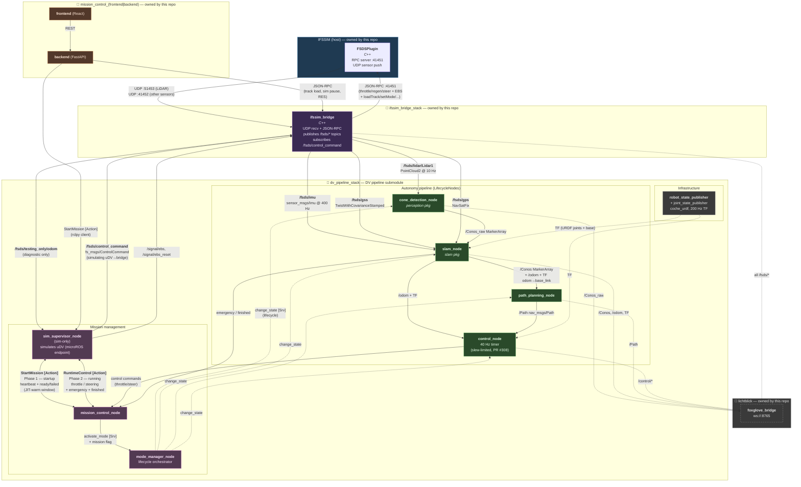
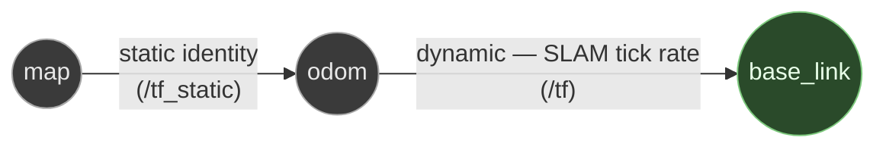

# Autonomy pipeline

End-to-end overview of the autonomy stack: from raw LiDAR/IMU coming out of UE5 through perception, SLAM, path planning, and control — and back to UE5 as a `ControlCommand`. Read this before touching any of the autonomy nodes.

For sim-side topics (sensors, vehicle physics, RPC) see [`FUNCTIONALITIES.md`](FUNCTIONALITIES.md). For container layout and how to launch the stack see [`GETTING_STARTED_DOCKER.md`](GETTING_STARTED_DOCKER.md).

The DV pipeline (perception, SLAM, path planning, control, mission management) lives in a separate repo and is attached here as a submodule. The point of the split is that **the same code runs on the real car and in sim** — IFSSIM owns everything that fakes the real-car environment for it (sim, sim ↔ ROS bridge, Mission Control web, visualisation, Docker glue), and the autonomy submodule sees the same ROS interface either way. This is the central organising principle of the architecture and shows up in every section below.

## Component ownership

| Side | Owner | Lives in |
|---|---|---|
| Sim (UE5 + FSDSPlugin) | IFSSIM | this repo, `Plugins/FSDSPlugin/` |
| Sim ↔ ROS bridge | IFSSIM | this repo, `ros2/src/ifssim_bridge/` |
| Mission Control web (frontend + backend) | IFSSIM | this repo, `tools/mission_control/` |
| Visualisation (Lichtblick + layouts) | IFSSIM | this repo, `lichtblick/`, container `lichtblick` |
| Mission management (`sim_supervisor`, `mission_control`, `mode_manager`) | DV pipeline | submodule |
| Autonomy lifecycle nodes (`perception`, `slam`, `path_planning`, `control`) | DV pipeline | submodule |
| `coche_urdf` + `robot_state_publisher` | DV pipeline | submodule |
| Docker / compose / launch glue | IFSSIM | this repo, `docker/` |

### Roles inside mission management

- **`sim_supervisor_node`** simulates the role the IFS-08 uDV (the on-vehicle microcontroller) plays on the real car. In sim it sources the `GO` signal and sinks the `FINISHED` signal; on the real car the physical uDV plays that role. This node only exists in sim.
- **`mission_control_node`** receives the selected mission, drives the autonomy lifecycle through `mode_manager`, exchanges heartbeats with the supervisor during startup, and forwards control commands from the autonomy stack to the supervisor (in sim) or to the uDV over USB CDC running microROS (real car). Because the uDV is a microROS endpoint, the DVPC↔uDV exchange is **already a ROS 2 client-server interaction on the real car** — the only thing that changes between sim and real is the underlying DDS transport (intra-process in sim, USB-CDC-framed microROS in real).
- **`mode_manager_node`** brings up the correct lifecycle nodes for the mission and passes them the mission-specific flag/strategy so each node knows which behaviour to run.
- **Autonomy lifecycle nodes** internally use a strategy pattern keyed on the mission flag, so the same node binary handles trackdrive / autocross / accel / skidpad with different inner behaviours.

`mission_control_node` and `sim_supervisor_node` are **always co-resident in sim** — the supervisor doesn't host the DVPC role itself. The autonomy stack's view of the world is therefore the same in sim and on the real car: identical ROS 2 client calls into a microROS endpoint, with only the underlying DDS transport differing. `mission_control_backend` (the web stack) only ever targets the supervisor's `StartMission` action; it never short-circuits straight to `mission_control_node`.

Odometry lives inside `slam_node` (or in a thin fusion library it imports) rather than as a separate node — see [Open questions](#open-questions) for the exact placement decision, which has consequences for how DA degradation in cone-only sections is recoverable.

## End-to-end graph

The runtime control loop mirrors the real-car path: the autonomy stack does **not** publish actuator commands directly to the sim. `control_node` sends commands to `mission_control_node`, which forwards them to `sim_supervisor_node` (the simulated uDV), which publishes them to the bridge. On the real car the same `mission_control_node` forwards to the physical uDV over USB CDC running microROS — semantically identical ROS 2 client calls, only the transport changes. The sim path is one redirect longer than strictly necessary on purpose, so a bug in the chain shows up in sim before it shows up at the test track.

Solid arrows are ROS topics, RPC, or Action exchanges; dashed arrows are TF, services, or visualisation side-channels. Bidirectional `<-->` arrows represent ROS Actions (request + heartbeats + result).

Colour key: blue = sim, purple = bridge, orange = Mission Control web, magenta = mission management ROS nodes, green = autonomy lifecycle nodes, grey = infrastructure / viz.

## The integration contract

This is the API surface between IFSSIM and the DV pipeline submodule. **Any change here is a breaking interface change** and must be coordinated.

### Topics IFSSIM publishes (bridge → submodule)

All sensor topics are namespaced under `/fsds/...` — the prefix is what tells the submodule "this is a simulated sensor, not real hardware." On the real car these come from real driver nodes under different names; the bridge is what fakes the FSDS-namespaced surface in sim.

| Topic | Type | Frame | Rate | Notes |
|---|---|---|---|---|
| `/fsds/lidar/Lidar1` | `sensor_msgs/PointCloud2` | `fsds/Lidar` | 10 Hz | LiDAR point cloud — XYZ only, no intensity. |
| `/fsds/imu` | `sensor_msgs/Imu` | `fsds/IMU` | ~400 Hz | 6-DoF IMU. |
| `/fsds/gss` | `geometry_msgs/TwistWithCovarianceStamped` | `fsds/GSS` | ~100 Hz | Ground-speed sensor. Bridge fills the diagonal of `twist.covariance` (entries `[0]`, `[7]`, `[14]`) from `VelocityNoiseStd²`. |
| `/fsds/gps` | `sensor_msgs/NavSatFix` | `fsds/GPS` | ~10 Hz | Currently logged-only on the autonomy side. |
| `/fsds/motor_rpm` | `std_msgs/Float32` | — | ~80 Hz | Optional input — may be redundant with `/fsds/gss`. |
| `/fsds/testing_only/odom` | `nav_msgs/Odometry` | `odom` (child `base_link`) | ~80 Hz | **Diagnostic only.** Ground-truth pose + clean body-frame velocity. Autonomy must not consume it; intended for the GT-as-SLAM diagnostic (`pipeline/cone_slam/scripts/gt_pose_relay.py`) and `sim_supervisor_node`'s GT compare. Both `pose` and `twist` are sourced directly from the vehicle pawn's clean kinematics, not from sensor topics; the GSS-routed twist behaviour is on `/fsds/gss` where the noise belongs. |

### Topics the submodule publishes back (sim_supervisor → bridge)

The submodule's autonomy stack does **not** publish actuator commands directly to the bridge. Commands flow through `mission_control_node` and `sim_supervisor_node` first, so the sim path matches the real-car `DVPC → uDV (microROS over USB CDC)` chain. The bridge only ever sees commands from `sim_supervisor_node`.

| Topic | Type | Publisher | Notes |
|---|---|---|---|
| `/fsds/control_command` | `fs_msgs/ControlCommand` | `sim_supervisor_node` | Throttle / regen / steering. The bridge subscribes; `control_node` does **not** publish here directly. |
| `/signal/ebs` (latched) | `std_msgs/Empty` | `sim_supervisor_node` | EBS trigger. |
| `/signal/ebs_reset` (latched) | `std_msgs/Empty` | `sim_supervisor_node` | EBS reset on autonomy boot. |

The bridge tolerates startup-time absence of `/fsds/control_command` until Phase 1 of the runtime action protocol reports `ready` — actuator commands only start flowing after the autonomy lifecycle has fully come up.

### Runtime action protocol (sim_supervisor ↔ mission_control)

The control loop is a two-phase ROS Action exchange between `sim_supervisor_node` and `mission_control_node`:

**Phase 1 — startup.** The supervisor sends an Action goal carrying the chosen mission (`trackdrive`, `autocross`, `accel`, `skidpad`). The mission controller drives `mode_manager` to bring up the right lifecycle nodes with the right strategy flag, sends periodic heartbeats back to the supervisor (so a crashed startup is detectable), then reports `ready` or `failed`. The startup window is also where Numba JIT compile for the planner runs — designed deliberately to absorb the first-call compile delay that would otherwise let the autonomy enter the runtime phase before the planner is ready.

If the operator changes the mission during this window (e.g. switches accel → skidpad), the in-flight startup is cancellable and the system can re-enter Phase 1 for the new mission without a full restart.

**Phase 2 — runtime.** Once Phase 1 reports `ready`, a second Action between the same two nodes carries:

- `throttle`, `steering` — the normal control commands, sourced from the autonomy's `control_node`.
- `emergency` — flag for emergency braking. Sourced from `slam_node` or any node detecting an unrecoverable state.
- `finished` — flag for "mission completed", sourced from `slam_node` (e.g. on big-orange detection past the lap-min-distance gate).

The supervisor publishes the resulting commands to `/fsds/control_command` for the bridge to forward to FSDS. On the real car, the same commands go from `mission_control_node` to the physical uDV via standard ROS 2 client calls (microROS over USB CDC), and `sim_supervisor_node` doesn't run.

### Mission-control-web → mission management

The Mission Control FastAPI backend calls into the supervisor's Action interface to drive the lifecycle, and into the bridge's JSON-RPC for sim-side actions:

| Surface | Type | Source | Target | Purpose |
|---|---|---|---|---|
| Start mission | `Action StartMission` (rclpy client) | `mission_control_backend` | `sim_supervisor_node` | Kicks off Phase 1; supervisor relays to `mission_control_node`. |
| Track load, sim pause/resume, RES | JSON-RPC | `mission_control_backend` | `ifssim_bridge` | Sim-only sandbox controls. |

Bridge JSON-RPC (track load, sim pause/resume, sim-side RES, sensor probe) stays on the IFSSIM side. Sim-only commands belong on the IFSSIM side; mission state belongs on the submodule side via the supervisor.

**Lifecycle orchestration mechanism.** The submodule's nodes start with the container in the standard ROS 2 `unconfigured` lifecycle state — `docker compose up` brings the autonomy launch up, no flag-file watcher, no `subprocess.Popen` from the backend. `mission_control_backend` never spawns or kills processes; all transitions are driven by `StartMission` Action calls into `sim_supervisor_node`, which fans out `change_state` services through `mode_manager_node` to each lifecycle node. This mirrors how the real car works (processes always running under systemd-equivalent; the physical uDV — a microROS endpoint over USB CDC — sources `GO`/`FINISHED` into the same lifecycle services that the simulator-side supervisor feeds in sim). Stopping a session is `deactivate` + `cleanup`, not `kill`.

## TF tree

- **`map → odom`** is published as static identity by `slam_node`. Without GPS-aligned global localisation the SLAM odom frame *is* effectively the map for downstream consumers; the static is there mainly so visualisers can root themselves on `map`.
- **`odom → base_link`** is the dynamic vehicle pose published by `slam_node` at SLAM tick rate. `base_link` is the canonical vehicle frame everywhere — the bridge already roots its sensor static TFs there (`base_link → fsds/IMU`, `base_link → fsds/Lidar`, `base_link → fsds/GPS`), and the autonomy stack uses the same name. No `fsds/FSCar` aliasing.
- The bridge does **not** publish any dynamic TF. Sensor messages carry sensor-local `frame_id`s (`fsds/IMU`, `fsds/GPS`, `fsds/Lidar`) that are not part of the live TF chain — autonomy nodes consume the sensors directly without TF lookups.
- `robot_state_publisher` + `joint_state_publisher` (in `coche_urdf`) publish URDF joint TFs at 200 Hz for visualisation and any downstream consumer that needs articulation.

## Open questions

Architectural choices still being finalised. Listed here because they have downstream consequences worth being deliberate about.

| # | Question | Owner |
|---|---|---|
| Q1 | **Where does `/odom` come from?** Options: (a) `slam_node` publishes `/odom` directly — folds odometry into SLAM (re-creates the coupling that bit cone-only DA in #306); (b) thin `odometria` library inside `slam` that fuses IMU + GSS but isn't a separate lifecycle node; (c) `sim_supervisor` publishes a GT-derived `/odom` in sim, real car gets it from the uDV. Option (b) preserves the separation that made the GT-as-SLAM diagnostic viable. | DV pipeline |

## Diagnostic tools

Co-located with the autonomy stack rather than under `tools/`, so they're easy to find when reading the SLAM code.

- **`pipeline/cone_slam/scripts/gt_pose_relay.py`** — a standalone ROS node that replaces `slam_node` by republishing `/fsds/testing_only/odom` under the same node-name and topic contract. Diagnostic for isolating "is SLAM the bottleneck or the consumers?" without changing any consumer. The local finite-difference velocity path inside the relay is a holdover from the earlier asymmetric-twist behaviour and can be retired once the bridge fix lands; it doesn't hurt anything to leave in place as a safety net.
- **`pipeline/cone_slam/scripts/replay_slam.py`** — offline replay of a captured rosbag through the SLAM node. Deterministic reproduction for failure analysis without a running sim.
- **`SLAM_OBS` per-second log line** in `slam_node` — live obs/assoc/new/skip counters; the cleanest way to see a DA cascade in real time.
- **`tools/refresh-bridge.sh`** — full container teardown + recreate when Docker UDP wedges or DDS state goes stale on macOS.

## See also

- [`FUNCTIONALITIES.md`](FUNCTIONALITIES.md) — sim-side topics, sensors, vehicle physics, RPC.
- [`GETTING_STARTED_DOCKER.md`](GETTING_STARTED_DOCKER.md) — container layout and how to launch the stack.
- [#255](https://github.com/isc-fs/IFSSIM/issues/255) — LiDAR per-point intensity. The cone-colour signal `slam_node`'s DA needs lives upstream of every pipeline node and depends on UE5 plugin work; IFSSIM-side prerequisite.
