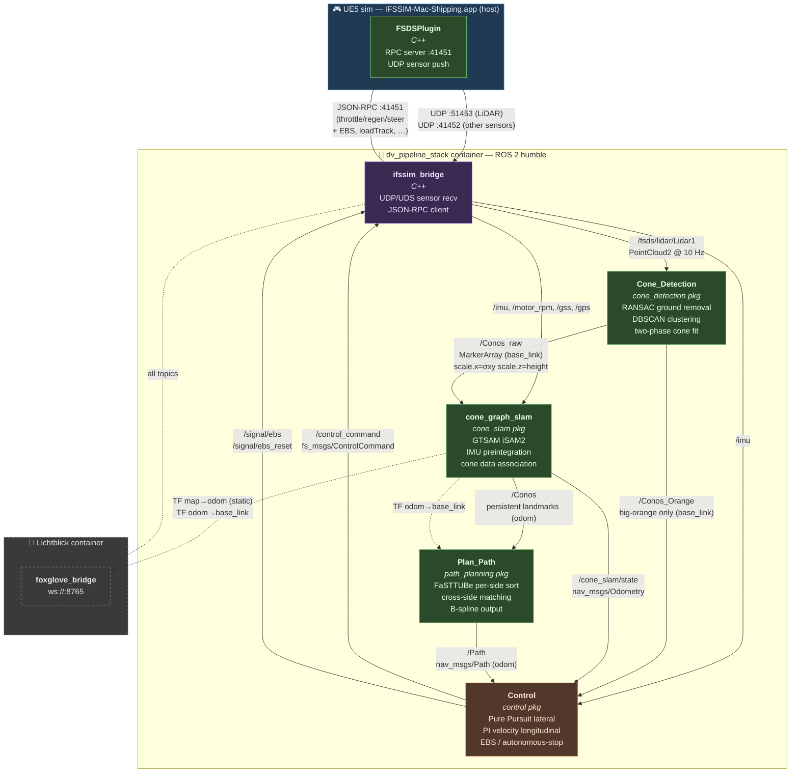
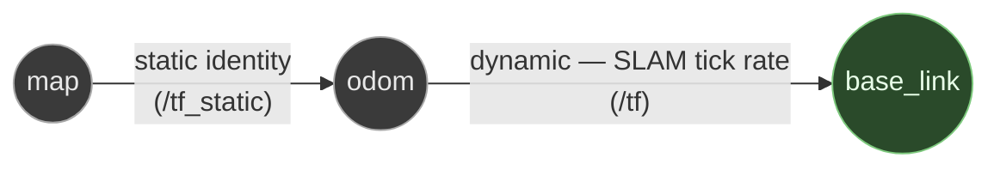

# Autonomy pipeline

End-to-end overview of the ROS 2 autonomy stack that drives the simulated car: from raw LiDAR/IMU coming out of UE5 through cone detection, SLAM, path planning, and control — and back to UE5 as a `ControlCommand`. Read this before touching any of `pipeline/`.

For sim-side topics (sensors, vehicle physics, RPC) see [`FUNCTIONALITIES.md`](FUNCTIONALITIES.md). For container layout and how to launch the stack see [`GETTING_STARTED_DOCKER.md`](GETTING_STARTED_DOCKER.md).

## End-to-end data flow

Solid arrows are ROS topics; dashed arrows are TF lookups or visualization side-channels. Colour: blue = sim, purple = bridge, green = production ROS nodes, orange = controller, grey = visualization.

## TF tree

- **`map → odom`** is published as identity on `/tf_static` by `cone_graph_slam_node`. We don't have GPS-aligned global localisation, so the SLAM odom frame *is* effectively the map for downstream consumers; the static is there mainly so Lichtblick / Foxglove 3D panels can root themselves on `map`.
- **`odom → base_link`** is the dynamic vehicle pose published by `cone_graph_slam_node` from its EKF state at SLAM tick rate.
- The bridge does **not** publish any dynamic TF. Raw sensor messages carry sensor-local `frame_id`s (`fsds/IMU`, `fsds/GPS`, `fsds/Lidar`) that are not part of the live TF chain — the pipeline consumes the sensors directly without TF lookups.
- `/fsds/testing_only/odom` (frame `odom`, child `fsds/FSCar`) is a ground-truth odometry feed published by the bridge for debugging and offline analysis only. The autonomy must not consume it.

## Pipeline packages

The four production packages, top-to-bottom in the dataflow:

| Order | Package | Node | Purpose |
|---|---|---|---|
| 1 | `pipeline/cone_detection/` | `Cone_Detection` | LiDAR → raw cone observations |
| 2 | `pipeline/cone_slam/`      | `cone_graph_slam` | factor-graph SLAM map + odom |
| 3 | `pipeline/path_planning/`  | `Plan_Path` | centerline path generation |
| 4 | `pipeline/control/`        | `Control` | pure-pursuit + PI → throttle/regen/steer |

### 1. Cone detection — `pipeline/cone_detection/cone_detection/cone_detection_node.py`

- **In:** `/fsds/lidar/Lidar1` (`sensor_msgs/PointCloud2`, frame `fsds/Lidar`).
- **Out:** `/Conos_raw` and `/Conos_Orange` (`visualization_msgs/MarkerArray`, frame `base_link`).
- RANSAC ground-plane removal (Numba-jitted, subsampled to 5 000 points per iteration — see [#247](https://github.com/isc-fs/IFSSIM/issues/247)) → DBSCAN clustering → two-phase L-BFGS-B parametric cone fit with centroid fallback. Cluster height threshold separates big-orange (505 mm) from blue/yellow (325 mm).
- Per-cone metadata is layered onto `Marker.scale`: `scale.x` carries σxy (observation position uncertainty, sentinel −1 = unknown), `scale.z` carries cluster height. Downstream SLAM consumes both.
- A per-second `CONE_FILTER` diagnostic line logs the fall-off through each filter stage (input points → clusters → ≥2 pts → height gate → fit/centroid). Use it when observations look thin — it localises the loss in one scan instead of bisecting through the pipeline.
- Package was named `slam` until [PR #251](https://github.com/isc-fs/IFSSIM/pull/251); renamed to remove the clash with `cone_slam` (which is the actual SLAM stage below).

### 2. Cone-graph SLAM — `pipeline/cone_slam/cone_slam/cone_graph_slam_node.py`

- **In:** `/Conos_raw`, `/imu`, `/motor_rpm`.
- **Out:** `/cone_slam/state` (`nav_msgs/Odometry`, frame `odom`, child `base_link`), `/Conos` (`MarkerArray` in `odom` — landmarks). Publishes TF `map → odom` (static) and `odom → base_link` (dynamic).
- GTSAM iSAM2 incremental factor-graph optimisation. Trigger is each `/Conos_raw` scan; IMU pre-integration provides the motion prior between scans, motor RPM is a slow speed reference. Big-orange cones are **not** added to the map (they're handled by `/Conos_Orange` directly to avoid colour confusion with the blue/yellow associator).
- Internal modules: `factor_graph.py` (GTSAM graph construction), `imu_preintegrator.py` (pre-integrated IMU factor), `data_association.py` (Hungarian cone-to-landmark matching), `landmark_db.py` (persistent ID tracking), `color_classifier.py` (BLUE / YELLOW / ORANGE / BIG_ORANGE).
- Design rationale and per-iteration tuning history are archived in [`history/cone_graph_slam_design.md`](history/cone_graph_slam_design.md) and [`history/cone_graph_slam_progress.md`](history/cone_graph_slam_progress.md).
- Open issue: the colour classifier has a centre-band fallthrough that mis-labels far cones at low bearing as ORANGE — see [`fix/241` audit findings](https://github.com/isc-fs/IFSSIM/) for the proposed fix.

### 3. Path planner — `pipeline/path_planning/path_planning/`

- **In:** `/Conos` (the SLAM-mapped cones in `odom`). Looks up TF `odom → base_link` for the car pose.
- **Out:** `/Path` (`nav_msgs/Path` in `odom`).
- Wraps the FaSTTUBe Formula Student path-planning library (`fsd_path_planning.PathPlanner`, [papalotis/ft-fsd-path-planning](https://github.com/papalotis/ft-fsd-path-planning), MIT). The library sorts each side of the track independently, matches cones across sides, and outputs a parameterised B-spline. Per-side sort + cross-side matching is robust to:
  - One-sided observation at corner exits (the inside arc rolling out of the FoV before fresh inside cones come into view).
  - Spurious off-side cones in the cone soup (orange ghosts caused by the SLAM colour classifier above) — they don't form a plausible per-side sequence, so the sort drops them.
- Adapter (`fasttube_adapter.py`) translates between our `Cone` / `Pose2D` types and the library's `ConeTypes` / `(global_cones, car_position, car_direction)` surface, swallows library exceptions on degenerate inputs (rate-limited log), and recomputes per-pose-point yaw from finite differences (the controller doesn't read the library's curvature output anyway).
- Two opt-in env knobs for perf debugging (off by default in production):
  - `DV_PLANNER_PERF=1` — log P50/P95/max of the inner library call once per ~5 s.
  - `DV_PLANNER_EXPERIMENTAL=1` — pass `experimental_performance_improvements=True` to the library (~20% P50 win at the cost of slightly different algorithm logic per upstream's README).
- Optional capture: `DV_PLANNER_CAPTURE=/path/to/file.jsonl` — one JSON line per callback (cones, pose, n_path) for offline replay.
- The pre-FaSTTUBe in-house Delaunay+walker planner was removed in [PR #244](https://github.com/isc-fs/IFSSIM/pull/244). Skidpad / acceleration mission support is tracked in [#243](https://github.com/isc-fs/IFSSIM/issues/243); planner CPU optimisation in [#246](https://github.com/isc-fs/IFSSIM/issues/246).

### 4. Control — `pipeline/control/control/`

- **In:** `/Path`, `/cone_slam/state`, `/Conos_Orange`, `/imu`.
- **Out:** `/control_command` (`fs_msgs/ControlCommand` — throttle / regen / steering), `/signal/ebs`, `/signal/ebs_reset`.
- Layout:
  - `state.py` — body-frame state snapshot built from `/cone_slam/state` (the twist's child frame is `base_link`).
  - `reference.py` — path-projection / lookahead utilities. Reads only `(x, y)` from the `nav_msgs/Path` poses and recomputes yaw + curvature from finite differences.
  - `controllers/pure_pursuit.py` — lateral controller (Pure Pursuit, lookahead-based steering).
  - `controllers/pi_velocity.py` — longitudinal controller (PI on velocity, with a single-quadrant regen guard at `v < threshold` so we don't push the car backward from rest).
  - `models/bicycle.py` — kinematic bicycle for the lateral controller's geometry.
  - `control_node.py` — the ROS-facing wrapper that wires everything together.
- On init the node publishes `/signal/ebs_reset` (latched) so a fresh autonomy instance can drive without manual EBS clearing. The stop-latch (autonomous finish on big-orange detection) only arms after the car has travelled >30 m from start, so the spawn-line big-orange doesn't trigger an immediate stop.
- The motor controller in UE5 is single-quadrant regen on the EMRAX 228 model (see [`FUNCTIONALITIES.md`](FUNCTIONALITIES.md)) — regen demand on a stationary or backward-rotating wheel is clamped to zero in `EmraxMotor.cpp`, so the controller can issue regen near zero velocity safely.

## Topic reference (live pipeline)

Quick lookup for what each topic carries, who publishes, who consumes, and what frame.

| Topic | Type | Publisher | Subscribers | Frame |
|---|---|---|---|---|
| `/fsds/lidar/Lidar1` | `sensor_msgs/PointCloud2` | bridge | Cone_Detection | `fsds/Lidar` |
| `/imu` | `sensor_msgs/Imu` | bridge | cone_graph_slam, control | `fsds/IMU` |
| `/motor_rpm` | `std_msgs/Float32` | bridge | cone_graph_slam | — |
| `/gss` | `geometry_msgs/TwistStamped` | bridge | (logged only) | `fsds/GSS` |
| `/gps` | `sensor_msgs/NavSatFix` | bridge | (logged only) | `fsds/GPS` |
| `/Conos_raw` | `visualization_msgs/MarkerArray` | Cone_Detection | cone_graph_slam | `base_link` |
| `/Conos_Orange` | `visualization_msgs/MarkerArray` | Cone_Detection | control | `base_link` |
| `/Conos` | `visualization_msgs/MarkerArray` | cone_graph_slam | Plan_Path | `odom` |
| `/cone_slam/state` | `nav_msgs/Odometry` | cone_graph_slam | control | `odom` (child `base_link`) |
| `/Path` | `nav_msgs/Path` | Plan_Path | control | `odom` |
| `/control_command` | `fs_msgs/ControlCommand` | control | bridge | — |
| `/signal/ebs` | `std_msgs/Empty` (latched) | control | bridge | — |
| `/signal/ebs_reset` | `std_msgs/Empty` (latched) | control | bridge | — |
| `/signal/go` | `fs_msgs/GoSignal` | bridge | (mission_control hook) | — |
| `/signal/finished` | `std_msgs/Empty` | control | bridge | — |
| `/tf_static` | `tf2_msgs/TFMessage` | cone_graph_slam | TF buffers | — |
| `/tf` | `tf2_msgs/TFMessage` | cone_graph_slam | TF buffers (Plan_Path) | — |
| `/fsds/testing_only/odom` | `nav_msgs/Odometry` | bridge | (debug only) | `odom` |
| `/fsds/testing_only/track` | `MarkerArray` | bridge | (debug only) | `map` |

## Side channels alongside the main loop

- **Mission Control** (`tools/mission_control/`) talks to the bridge over the FSDS RPC port (start/stop session, load track, RES, EBS, snapshot referee state). It does not sit on the ROS topic chain — it manipulates the sim and the autonomy lifecycle from the side.
- **`/Conos_Orange`** is a dedicated stream of big-orange (finish-line) cones in `base_link`. The control node consumes it directly to implement the autonomous-stop logic without going through SLAM.
- **EBS / EBS-reset** are latched `std_msgs/Empty` topics (`/signal/ebs`, `/signal/ebs_reset`) the control node publishes for the bridge to act on.

## Mission Control hooks

`tools/mission_control/backend/main.py` is a FastAPI app that orchestrates the autonomy lifecycle. The user-visible Start Session sequence:

1. Stop the autonomy pipeline (kills the launched processes inside the container).
2. Activate RES (autonomy-disable signal — the bridge holds the car).
3. Set the FSDS event mode (e.g. trackdrive).
4. Resume the sim from pause.
5. Start the autonomy pipeline.
6. Wait ~4.5 s for SLAM to produce a calibrated estimate.
7. Auto-release the EBS so the controller can issue commands.

Guardrails the audit + recent fixes added:

- `event_start` refuses with HTTP 400 if the loaded track has zero cones (silent track-load failures used to leave the event running on stale level state).
- `/api/res/activate` no longer kills the autonomy pipeline; it only pulses the RES line.
- The EMRAX idle creep torque was disabled (was 5 Nm — a Chaos workaround that produced ~0.83 m/s drift whenever EBS was released without an autonomy command).

A faithful FS-DV state machine (T 14.8.x: `AS_Off` / `AS_Ready` / `AS_Driving` / `AS_Finished` / `AS_Emergency`) is tracked in [#173](https://github.com/isc-fs/IFSSIM/issues/173); the current Mission Control sequence is the staged stand-in until that lands.

## Resource budget at runtime

After [PR #248](https://github.com/isc-fs/IFSSIM/pull/248) (cone_detection RANSAC subsample + BLAS thread cap), steady-state CPU on a Mac M-series host running Docker:

| Component | CPU | Notes |
|---|---|---|
| Container total | **~190%** (≈ 2 cores) | Was ~1000% (10 cores) before #248 |
| Cone_Detection | 53–80% (2 BLAS threads) | RANSAC + DBSCAN |
| cone_graph_slam | ~20% | GTSAM optimisation |
| Plan_Path | ~7% | FaSTTUBe inner loop ~10 ms P50 |
| Control | ~13% | Pure pursuit + PI |
| ifssim_bridge (C++) | ~17% | UDP recv + JSON-RPC |
| foxglove_bridge | 0–8% | Idle when no client connected |

`/Path` publishes at ~7–10 Hz with the FaSTTUBe planner (callback rate matches `/Conos`); some scans return empty when the library throws `LinAlgError` on degenerate cone configurations — tracked in [#246](https://github.com/isc-fs/IFSSIM/issues/246).

## When the car won't drive — debugging order

1. Is a track loaded? `/api/track/state` should show `cones > 0`. If not, Start Session would refuse anyway since #61.
2. Are cones being detected? Watch the per-second `CONE_FILTER` log line from `Cone_Detection`. Stage drop-off shows you which gate (min-points, height, fit/centroid) is shedding observations.
3. Is SLAM producing landmarks? `/Conos` non-empty + `/cone_slam/state` ticking. If `/Conos_raw` is high but `/Conos` stays low, SLAM gating is the bottleneck (#177 was an instance).
4. Is the planner emitting a path? `ros2 topic hz /Path` should match the `/Conos` rate. If the planner's `plan_empty` counter (in the per-second `PATH_RATE` log line) is high, the FaSTTUBe library is throwing on the cone configuration — set `DV_PLANNER_PERF=1` for timing detail and check the warning logs for the exception type.
5. Is the controller issuing commands? `/control_command` should tick at the controller rate. Zero throttle with a non-empty `/Path` usually means the controller's stop-latch fired or the velocity reference is zero.
6. Is the EBS released? `getEbsLatched` via the bridge RPC — if it returns `true`, the car physically can't move. Mission Control's "event_start" releases it; manual `releaseEbs` RPC works too.
7. If `/control_command` looks healthy and EBS is released but the car doesn't move: bridge half-open TCP issue. `tools/refresh-bridge.sh` clears it. Tracked as a recurring nuisance; no root fix yet.
