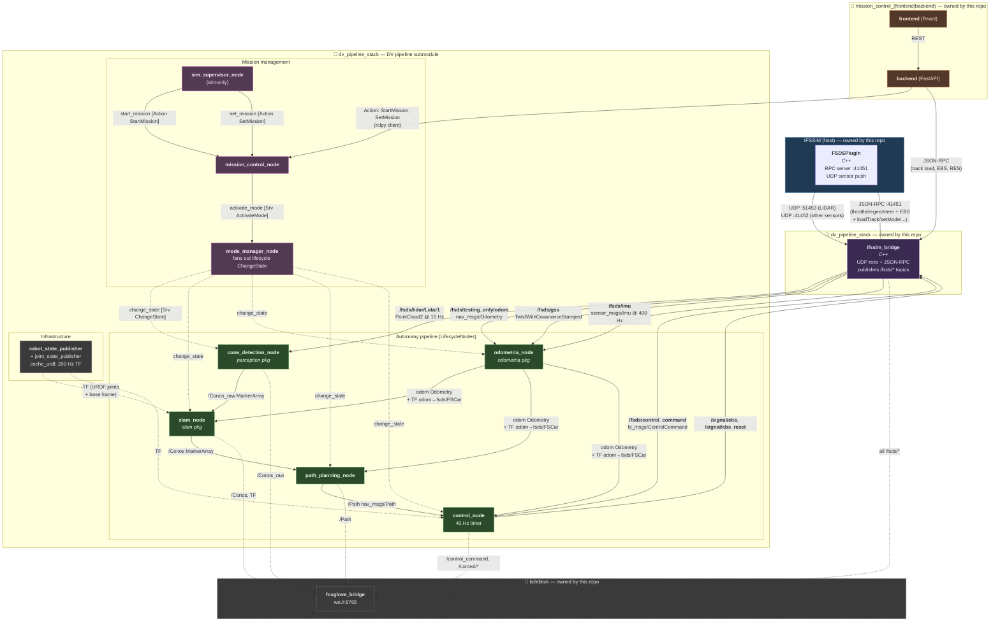

# Integrated architecture (IFSSIM ↔ DV pipeline handoff)

This document describes the **target end-state architecture** after the DV pipeline (cone_detection, slam, path_planning, control, odometria, mission management) is migrated out of this repo into a separate team's repo and re-attached as a submodule. It splices the new team's pipeline-block diagram into the IFSSIM-side sim, bridge, mission-control-web and visualisation layers — so the contract between the two halves is explicit on one page.

For the legacy in-tree pipeline that exists today (the one being phased out), see [`autonomy_pipeline.md`](autonomy_pipeline.md). For the freeze and handoff context, see [#311](https://github.com/isc-fs/IFSSIM/issues/311).

## Scope split

| Side | Owner | Lives in |
|---|---|---|
| Sim (UE5 + FSDSPlugin) | IFSSIM | this repo, `Plugins/FSDSPlugin/` |
| Sim ↔ ROS bridge | IFSSIM | this repo, `ros2/src/ifssim_bridge/` |
| Mission Control web (frontend + backend) | IFSSIM | this repo, `tools/mission_control/` |
| Visualisation (Lichtblick + layouts) | IFSSIM | this repo, `lichtblick/`, container `lichtblick` |
| Mission management (`sim_supervisor`, `mission_control`, `mode_manager`) | DV pipeline team | external repo, attached as submodule |
| Autonomy lifecycle nodes (`perception`, `slam`, `odometria`, `path_planning`, `control`) | DV pipeline team | external repo, attached as submodule |
| `coche_urdf` + `robot_state_publisher` | DV pipeline team | external repo, attached as submodule |
| Docker / compose / launch glue | IFSSIM | this repo, `docker/` |

The DV pipeline submodule is intended to be the **same code on the real car and in sim**. IFSSIM is responsible for everything that fakes the real-car environment for it.

## End-to-end graph

Solid arrows are ROS topics or RPC; dashed arrows are TF, services, or visualisation side-channels.

Colour key: blue = sim, purple = bridge, orange = Mission Control web, magenta = mission management ROS nodes, green = autonomy lifecycle nodes, grey = infrastructure / viz.

## The integration contract

This is the API surface between IFSSIM and the DV pipeline submodule. **Any change here is a breaking interface change** and must be coordinated.

### Topics IFSSIM must publish (bridge → submodule)

| Topic | Type | Frame | Rate | Notes |
|---|---|---|---|---|
| `/fsds/lidar/Lidar1` | `sensor_msgs/PointCloud2` | `fsds/Lidar` | 10 Hz | Already published. |
| `/fsds/testing_only/odom` | `nav_msgs/Odometry` | `odom` (child `fsds/FSCar`) | ~80 Hz | **Quirk:** `twist.linear.x/y` is currently zero — the bridge doesn't fill it (UE5 not pushing twist). The new `odometria_node` must finite-difference pose, or the bridge must be fixed to fill twist. Documented in `pipeline/cone_slam/scripts/gt_pose_relay.py` (PR #309) where the same workaround already exists. |
| `/fsds/gss` | `geometry_msgs/TwistWithCovarianceStamped` | `fsds/GSS` | TBD | **Type mismatch with current bridge.** Today's bridge publishes `/gss` (without prefix) as `geometry_msgs/TwistStamped` (no covariance). Either the bridge upgrades to `TwistWithCovarianceStamped` and adds the `/fsds/` prefix, or the submodule's `odometria_node` accepts `TwistStamped`. Needs a one-line decision. |
| `/fsds/imu` | `sensor_msgs/Imu` | `fsds/IMU` | ~400 Hz | Today published as `/imu`. Add `/fsds/` prefix or remap. |
| `/fsds/motor_rpm` | TBD (likely `std_msgs/Float32`) | — | ~80 Hz | Today published as `/motor_rpm`. Optional — if `/fsds/gss` provides ground-speed, motor RPM can be a redundant signal or dropped on the new arch. New team's call. |

### Topics the submodule must publish back (submodule → bridge)

| Topic | Type | Notes |
|---|---|---|
| `/fsds/control_command` | `fs_msgs/ControlCommand` | Throttle / regen / steering. Today consumed as `/control_command` after a launch-time remap; the remap goes away. |
| `/signal/ebs` (latched) | `std_msgs/Empty` | EBS trigger. |
| `/signal/ebs_reset` (latched) | `std_msgs/Empty` | EBS reset on autonomy boot. |

### Action / service interface (Mission Control web → mission management)

The Mission Control FastAPI backend (today on JSON-RPC over the bridge) calls into the submodule's typed ROS interfaces:

| Surface | Type | Source | Target | Purpose |
|---|---|---|---|---|
| `start_mission` | `Action StartMission` | mcbe | `mission_control_node` | Begin a session for a given mission (trackdrive / autocross / accel / skidpad). |
| `set_mission` | `Action SetMission` | mcbe | `mission_control_node` | Change the active mission while in `AS_Off`. |
| `activate_mode` | `Srv ActivateMode` | `mission_control_node` | `mode_manager_node` | Drive the AS state machine (`AS_Off` → `AS_Ready` → `AS_Driving` → ...). |
| `change_state` | `Srv ChangeState` (lifecycle_msgs) | `mode_manager_node` | each lifecycle node | Standard ROS 2 `LifecycleNode` transitions. |

Bridge JSON-RPC (track load, sim pause/resume, sim-side RES, sensor probe) stays on the IFSSIM side and remains called from the FastAPI backend directly. Sim-only commands belong on the IFSSIM side; mission state belongs on the submodule side.

## What changes from today

This is the ledger of work IFSSIM owes to make the new pipeline plug in.

### 1. Bridge topic naming + types

The bridge currently publishes a few topics under un-prefixed names that the new pipeline expects under `/fsds/...`. Today the launch file remaps them on the consumer side; on the new arch the consumer is in a separate submodule and we own the publisher, so the rename moves to the bridge.

- `/imu` → `/fsds/imu`
- `/gss` → `/fsds/gss` (and likely a type upgrade to `TwistWithCovarianceStamped`)
- `/motor_rpm` → `/fsds/motor_rpm` (or dropped if `/fsds/gss` covers it)
- `/control_command` (subscribed by bridge) → `/fsds/control_command`

Suggested approach: do this as a single bridge PR that changes both publish and subscribe names plus the type bump on `/fsds/gss`. Today's launch-file remaps in `pipeline_only.launch.py` are deleted as part of the same PR (since the in-tree pipeline is going away anyway).

### 2. Bridge twist field on `/fsds/testing_only/odom`

Either the bridge starts filling `twist.linear` from the FSDS RPC sensor data (correct fix), or the submodule's `odometria_node` finite-differences pose (matching what `gt_pose_relay.py` does today). The bridge fix is upstream and right; the consumer fix is local and pragmatic. The new team's call — flag it on integration kickoff.

### 3. Mission Control web ↔ mission management

The FastAPI backend in `tools/mission_control/backend/` currently orchestrates the autonomy lifecycle by killing/relaunching ROS launch under `entrypoint.sh`. Two options:

- **Option A — mcbe stays, switches transport.** Replace shell-orchestration with `rclpy` action clients calling `StartMission` / `SetMission` on `mission_control_node`. Bridge JSON-RPC for sim-side actions stays. Web UI keeps its current FastAPI surface to the React frontend. Cleanest; minimal churn for the frontend.
- **Option B — mcbe retires.** The new `mission_control_node` exposes a web interface directly (rosbridge / foxglove websocket) and the React frontend talks to it. Removes a layer; bigger frontend change.

Option A is the safer first move; Option B is on the table for later if the FastAPI layer no longer earns its keep. #173 is the open issue that subsumes this work.

### 4. Container layout

Today the `dv_pipeline_stack` container has the in-tree pipeline (`cone_detection`, `cone_slam`, `path_planning`, `control`) plus `ifssim_bridge`. After the migration:

- **`ifssim_bridge_stack`** (new container, ours) — only the bridge. Smaller image, clearer ownership.
- **`dv_pipeline_stack`** (existing container, repurposed) — only the submodule's nodes. Image reproducibly built from the submodule + their `Dockerfile`.

Two containers on the same `network_mode: host` (or one Docker network with `host.docker.internal` for cross-container) so DDS sees everything. Minor compose refactor; covered by the migration PR.

### 5. Visualisation

`lichtblick/*.json` layouts reference today's topic names (`/cone_slam/state`, `/Conos`, `/Conos_raw`, `/Path`, `/control_command`, ...). They need a one-pass topic-name update once the submodule lands. Easy mechanical change; do it in the same PR that adopts the submodule.

### 6. Frame names

The submodule's diagram terminates the TF chain at `fsds/FSCar`. Today our pipeline keys on `base_link`. Foxglove layouts and the bridge sensor `frame_id`s currently use `fsds/IMU`, `fsds/GPS`, `fsds/Lidar` — those stay (they're sensor-local). The vehicle frame switch from `base_link` to `fsds/FSCar` propagates through:

- `lichtblick/*.json` — layout root frames.
- `ifssim_bridge` — if any TF the bridge publishes uses `base_link` (today it doesn't, so probably no change here).
- `tools/mission_control/backend/` — any frame string assumptions in telemetry / scoring.

The submodule may instead opt to publish `fsds/FSCar` as an alias of `base_link` to keep REP-105 conventions; that's their call. Worth confirming on integration kickoff.

## What does NOT change

- The UE5 plugin and the FSDS RPC interface (`:41451`).
- The bridge's UDP transport ports (`:51453` LiDAR, `:41452` other sensors).
- The host-networking trick on macOS (PR #292) — still required.
- `tools/refresh-bridge.sh` and the rest of the dev tooling.
- The IFSSIM Mission Control web UX — the user-facing experience stays even if the transport underneath swaps.

## Migration order (suggested)

1. Submodule reaches a runnable state with stub mission management and pass-through `odometria_node` in sim mode.
2. Bridge PR: topic prefixes `/fsds/*` (sec. 1 above) + twist fill (sec. 2). Land on `dev` while the in-tree pipeline still works (the rename breaks the in-tree pipeline; this is the moment the in-tree pipeline gets retired).
3. Migration PR: drop in-tree `cone_slam/`, `cone_detection/`, `path_planning/`, `control/`. Add submodule. Update compose, launch, lichtblick layouts.
4. mcbe PR (Option A): switch from shell orchestration to `rclpy` action client.
5. End-to-end smoke test: Start Session → autonomy comes up via lifecycle services → laps `test_submodule`.
6. Close #311.

## See also

- [`autonomy_pipeline.md`](autonomy_pipeline.md) — legacy in-tree pipeline (the one being phased out).
- [#311](https://github.com/isc-fs/IFSSIM/issues/311) — pipeline freeze + handoff context.
- [#306](https://github.com/isc-fs/IFSSIM/issues/306) — the GT-as-SLAM diagnostic that motivated the odometry-split design above.
- [#173](https://github.com/isc-fs/IFSSIM/issues/173) — FS-DV state machine integration (subsumed by mission management on the new side).
- [#255](https://github.com/isc-fs/IFSSIM/issues/255) — LiDAR per-point intensity (still relevant; the new SLAM team will hit the same cone-only DA ceiling unless this is addressed).
