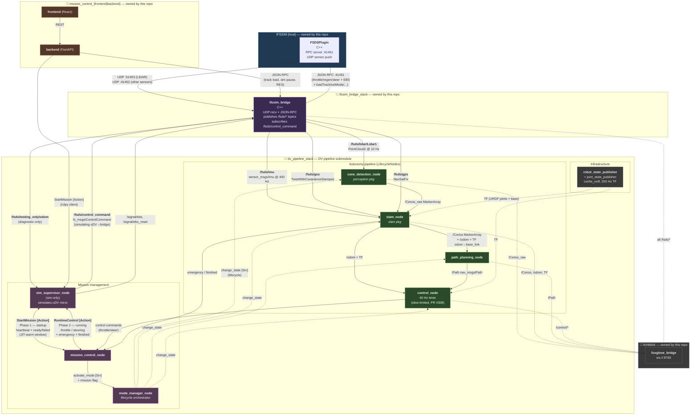

# Integrated architecture (IFSSIM ↔ DV pipeline handoff)

This document describes the **target end-state architecture** after the DV pipeline (cone_detection, slam, path_planning, control, odometria, mission management) is migrated out of this repo into a separate team's repo and re-attached as a submodule. It splices the new team's pipeline-block diagram into the IFSSIM-side sim, bridge, mission-control-web and visualisation layers — so the contract between the two halves is explicit on one page.

For the legacy in-tree pipeline that exists today (the one being phased out), see [`autonomy_pipeline.md`](autonomy_pipeline.md). For the freeze and handoff context, see [#311](https://github.com/isc-fs/IFSSIM/issues/311).

## Scope split

| Side | Owner | Lives in |
|---|---|---|
| Sim (UE5 + FSDSPlugin) | IFSSIM | this repo, `Plugins/FSDSPlugin/` |
| Sim ↔ ROS bridge | IFSSIM | this repo, `ros2/src/ifssim_bridge/` |
| Mission Control web (frontend + backend) | IFSSIM | this repo, `tools/mission_control/` |
| Visualisation (Lichtblick + layouts) | IFSSIM | this repo, `lichtblick/`, container `lichtblick` |
| Mission management (`sim_supervisor`, `mission_control`, `mode_manager`) | DV pipeline team | external repo, attached as submodule |
| Autonomy lifecycle nodes (`perception`, `slam`, `path_planning`, `control`) | DV pipeline team | external repo, attached as submodule |
| `coche_urdf` + `robot_state_publisher` | DV pipeline team | external repo, attached as submodule |
| Docker / compose / launch glue | IFSSIM | this repo, `docker/` |

The DV pipeline submodule is intended to be the **same code on the real car and in sim**. IFSSIM is responsible for everything that fakes the real-car environment for it.

### Roles inside mission management (per the pipeline team)

- **`sim_supervisor_node`** simulates the role the IFS-08 micro (uDV) plays on the real car. In sim it sources the `GO` signal and sinks the `FINISHED` signal; on the real car the physical micro plays that role. This node only exists in sim.
- **`mission_control_node`** receives the selected mission, drives the autonomy lifecycle through `mode_manager`, exchanges heartbeats with the supervisor during startup, and forwards control commands from the autonomy stack to the supervisor (in sim) or the micro over the DVPC bus (real car).
- **`mode_manager_node`** brings up the correct lifecycle nodes for the mission and passes them the mission-specific flag/strategy so each node knows which behaviour to run.
- **Autonomy lifecycle nodes** internally use a strategy pattern keyed on the mission flag, so the same node binary handles trackdrive / autocross / accel / skidpad with different inner behaviours.

Note: the pipeline team's diagram-snapshot still shows an `odometria_node`. That node is being removed; the autonomy lifecycle is `perception → slam → path_planning → control` only. Where odometry comes from on the new arch is still TBD (see [Open questions](#open-questions) below).

## End-to-end graph

The runtime control loop deliberately mirrors the real-car path: the autonomy stack does **not** publish actuator commands directly to the sim. Instead `control_node` sends commands to `mission_control_node`, which forwards them to `sim_supervisor_node` (the simulated micro), which finally publishes them to the bridge. On the real car the same `mission_control_node` forwards to the physical micro over the DVPC bus. The sim path is one redirect longer than strictly necessary on purpose, so a bug in the chain shows up in sim before it shows up at the test track.

Solid arrows are ROS topics, RPC, or Action exchanges; dashed arrows are TF, services, or visualisation side-channels. Bidirectional `<-->` arrows represent ROS Actions (request + heartbeats + result).

Colour key: blue = sim, purple = bridge, orange = Mission Control web, magenta = mission management ROS nodes, green = autonomy lifecycle nodes, grey = infrastructure / viz.

## The integration contract

This is the API surface between IFSSIM and the DV pipeline submodule. **Any change here is a breaking interface change** and must be coordinated.

### Topics IFSSIM must publish (bridge → submodule)

| Topic | Type | Frame | Rate | Notes |
|---|---|---|---|---|
| `/fsds/lidar/Lidar1` | `sensor_msgs/PointCloud2` | `fsds/Lidar` | 10 Hz | Already published. |
| `/fsds/imu` | `sensor_msgs/Imu` | `fsds/IMU` | ~400 Hz | Today published as `/imu`. Add `/fsds/` prefix or remap. |
| `/fsds/gss` | `geometry_msgs/TwistWithCovarianceStamped` | `fsds/GSS` | TBD | **Type mismatch with current bridge.** Today's bridge publishes `/gss` (without prefix) as `geometry_msgs/TwistStamped` (no covariance). Either the bridge upgrades to `TwistWithCovarianceStamped` and adds the `/fsds/` prefix, or the submodule subscribes to `TwistStamped`. Needs a one-line decision. |
| `/fsds/gps` | `sensor_msgs/NavSatFix` | `fsds/GPS` | ~10 Hz | Today published as `/gps`. Same prefix-rename. |
| `/fsds/motor_rpm` | TBD | — | ~80 Hz | Today published as `/motor_rpm`. Optional — if `/fsds/gss` covers ground-speed, motor RPM can be redundant. New team's call. |
| `/fsds/testing_only/odom` | `nav_msgs/Odometry` | `odom` (child `fsds/FSCar`) | ~80 Hz | **Diagnostic only on the new arch.** Consumed by `sim_supervisor_node` for ground-truth comparison and the GT-as-SLAM diagnostic pattern (`gt_pose_relay.py`, PR #309). The autonomy must not rely on it. **Quirk:** `twist.linear.x/y` is currently zero — bridge doesn't fill it. Fix at the bridge or finite-difference at the consumer. |

### Topics the submodule publishes back to the bridge (sim_supervisor → bridge)

The submodule's autonomy stack does **not** publish actuator commands directly to the bridge. Commands flow through `mission_control_node` and `sim_supervisor_node` first (so the sim path matches the real-car `DVPC → micro → CAN` chain). The bridge only ever sees commands from `sim_supervisor_node`.

| Topic | Type | Publisher | Notes |
|---|---|---|---|
| `/fsds/control_command` | `fs_msgs/ControlCommand` | `sim_supervisor_node` | Throttle / regen / steering. The bridge subscribes; the autonomy `control_node` does NOT publish to this directly. |
| `/signal/ebs` (latched) | `std_msgs/Empty` | `sim_supervisor_node` | EBS trigger. |
| `/signal/ebs_reset` (latched) | `std_msgs/Empty` | `sim_supervisor_node` | EBS reset on autonomy boot. |

### Runtime action protocol (sim_supervisor ↔ mission_control)

The control loop is a two-phase ROS Action exchange between `sim_supervisor_node` and `mission_control_node`:

**Phase 1 — startup.** The supervisor sends an Action goal carrying the chosen mission (`trackdrive`, `autocross`, `accel`, `skidpad`). The mission controller drives `mode_manager` to bring up the right lifecycle nodes with the right strategy flag, sends periodic heartbeats back to the supervisor (so a crashed startup is detectable), then reports `ready` or `failed`. The startup window is also where Numba JIT compile for the planner runs — explicit design fix for the "car drives straight on the first curve before the planner has compiled" failure that bit us in the in-tree pipeline.

If the operator changes the mission during this window (e.g. switches accel → skidpad), the in-flight startup is cancellable and the system can re-enter Phase 1 for the new mission without a full restart.

**Phase 2 — runtime.** Once Phase 1 reports `ready`, a second Action between the same two nodes carries:

- `throttle`, `steering` — the normal control commands, sourced from the autonomy's `control_node`.
- `emergency` — flag for emergency braking. Sourced from `slam_node` or any node detecting an unrecoverable state.
- `finished` — flag for "mission completed", sourced from `slam_node` (e.g. on big-orange detection past the lap-min-distance gate).

The supervisor publishes the resulting commands to `/fsds/control_command` for the bridge to forward to FSDS. On the real car, the same commands would go from `mission_control_node` to the physical micro over the DVPC bus, and `sim_supervisor_node` doesn't run.

### Mission-control-web → mission management

The Mission Control FastAPI backend calls into the supervisor's Action interface to drive the lifecycle, and into the bridge's JSON-RPC for sim-side actions:

| Surface | Type | Source | Target | Purpose |
|---|---|---|---|---|
| Start mission | `Action StartMission` (rclpy client) | mcbe | `sim_supervisor_node` | Kicks off Phase 1; supervisor relays to `mission_control_node`. |
| Track load, sim pause/resume, RES | JSON-RPC | mcbe | `ifssim_bridge` | Sim-only sandbox controls. |

Bridge JSON-RPC (track load, sim pause/resume, sim-side RES, sensor probe) stays on the IFSSIM side. Sim-only commands belong on the IFSSIM side; mission state belongs on the submodule side via the supervisor.

## What changes from today

This is the ledger of work IFSSIM owes to make the new pipeline plug in.

### 1. Bridge topic naming + types

The bridge currently publishes a few topics under un-prefixed names that the new pipeline expects under `/fsds/...`. Today the launch file remaps them on the consumer side; on the new arch the consumer is in a separate submodule and we own the publisher, so the rename moves to the bridge.

- `/imu` → `/fsds/imu`
- `/gss` → `/fsds/gss` (and likely a type upgrade to `TwistWithCovarianceStamped`)
- `/motor_rpm` → `/fsds/motor_rpm` (or dropped if `/fsds/gss` covers it)
- `/control_command` (subscribed by bridge) → `/fsds/control_command`

Suggested approach: do this as a single bridge PR that changes both publish and subscribe names plus the type bump on `/fsds/gss`. Today's launch-file remaps in `pipeline_only.launch.py` are deleted as part of the same PR (since the in-tree pipeline is going away anyway).

### 2. Bridge twist field on `/fsds/testing_only/odom`

Either the bridge starts filling `twist.linear` from the FSDS RPC sensor data (correct fix), or the submodule's `odometria_node` finite-differences pose (matching what `gt_pose_relay.py` does today). The bridge fix is upstream and right; the consumer fix is local and pragmatic. The new team's call — flag it on integration kickoff.

### 3. Mission Control web ↔ mission management

The FastAPI backend in `tools/mission_control/backend/` currently orchestrates the autonomy lifecycle by killing/relaunching ROS launch under `entrypoint.sh`. The new arch replaces the shell orchestration entirely:

- mcbe becomes an `rclpy` Action client of `sim_supervisor_node` (`StartMission`). The supervisor relays to `mission_control_node`, which drives `mode_manager` and the lifecycle nodes. Mcbe never talks to lifecycle services directly.
- Bridge JSON-RPC stays on the mcbe side for sim-only actions: track load, sim pause/resume, sim-side RES button, sensor probe.
- React frontend keeps its REST surface to mcbe. No frontend change.

This is the only viable shape given that `sim_supervisor_node` is the single entry point to the autonomy lifecycle in sim. #173 is the open issue that subsumes this work.

### 4. Control commands route through `sim_supervisor`, not directly to the bridge

This is structural, not a topic-rename. On the new arch the bridge subscribes to `/fsds/control_command` from `sim_supervisor_node` (which simulates the IFS-08 micro). The autonomy `control_node` publishes commands as part of an Action payload to `mission_control_node`, which forwards to the supervisor.

Implication for IFSSIM: nothing on the bridge subscriber side changes — it still subscribes to `/fsds/control_command`. But the topic publisher identity moves from "the autonomy's control node" to "the simulated micro node", which means the bridge must tolerate startup-time absence of this topic until Phase 1 reports `ready` (today's bridge sees the topic as soon as the autonomy launches).

### 5. Container layout

Today the `dv_pipeline_stack` container has the in-tree pipeline (`cone_detection`, `cone_slam`, `path_planning`, `control`) plus `ifssim_bridge`. After the migration:

- **`ifssim_bridge_stack`** (new container, ours) — only the bridge. Smaller image, clearer ownership.
- **`dv_pipeline_stack`** (existing container, repurposed) — only the submodule's nodes. Image reproducibly built from the submodule + their `Dockerfile`.

Two containers on the same `network_mode: host` (or one Docker network with `host.docker.internal` for cross-container) so DDS sees everything. Minor compose refactor; covered by the migration PR.

### 6. Visualisation

`lichtblick/*.json` layouts reference today's topic names (`/cone_slam/state`, `/Conos`, `/Conos_raw`, `/Path`, `/control_command`, ...). They need a one-pass topic-name update once the submodule lands. Easy mechanical change; do it in the same PR that adopts the submodule.

### 7. Frame names

The submodule's diagram terminates the TF chain at `fsds/FSCar`. Today our pipeline keys on `base_link`. Foxglove layouts and the bridge sensor `frame_id`s currently use `fsds/IMU`, `fsds/GPS`, `fsds/Lidar` — those stay (they're sensor-local). The vehicle frame switch from `base_link` to `fsds/FSCar` propagates through:

- `lichtblick/*.json` — layout root frames.
- `ifssim_bridge` — if any TF the bridge publishes uses `base_link` (today it doesn't, so probably no change here).
- `tools/mission_control/backend/` — any frame string assumptions in telemetry / scoring.

The submodule may instead opt to publish `fsds/FSCar` as an alias of `base_link` to keep REP-105 conventions; that's their call. Worth confirming on integration kickoff.

## Open questions

These came out of the pipeline team's architecture description and need a decision before integration kickoff. Captured here so they don't surface mid-migration.

| # | Question | Where decided |
|---|---|---|
| Q1 | **Where does `/odom` come from now that `odometria_node` is removed?** Options: (a) `slam_node` publishes `/odom` and TF the same way today's `cone_graph_slam` does — folds odometry back into SLAM and re-creates the coupling we deliberately broke; (b) keep a thin `odometria` library inside `slam` that fuses IMU + GSS but isn't a separate lifecycle node; (c) sim_supervisor publishes a GT-derived `/odom` for sim-only debugging, real car gets it from the micro. **Implication for the cone-only DA ceiling (#306):** option (a) reverts the architectural fix that made the GT-as-SLAM diagnostic viable. Option (b) keeps the separation. Worth getting right early. | Pipeline team |
| Q2 | `/fsds/gss` type — does the bridge upgrade to `TwistWithCovarianceStamped` or does the submodule subscribe to today's `TwistStamped`? | IFSSIM × pipeline team |
| Q3 | Real-car-DVPC presence in sim — is `mission_control_node` always run alongside `sim_supervisor_node`, or does the supervisor co-host the controller's logic in sim? Affects whether mcbe targets the supervisor or the controller. | Pipeline team |
| Q4 | Frame name `fsds/FSCar` vs REP-105 `base_link` — does the submodule publish both as aliases for compatibility with existing Lichtblick layouts and any IFSSIM-side TF lookups? | Pipeline team |
| Q5 | Does the bridge need to fill `twist.linear` on `/fsds/testing_only/odom`, or is the consumer (sim_supervisor for diagnostic comparison) OK finite-differencing pose? | IFSSIM |
| Q6 | What replaces the `entrypoint.sh` flag-file orchestration on the IFSSIM side? Mcbe spawning the submodule's launch via `subprocess`? Or compose-level service dependencies? | IFSSIM |

## What does NOT change

- The UE5 plugin and the FSDS RPC interface (`:41451`).
- The bridge's UDP transport ports (`:51453` LiDAR, `:41452` other sensors).
- The host-networking trick on macOS (PR #292) — still required.
- `tools/refresh-bridge.sh` and the rest of the dev tooling.
- The IFSSIM Mission Control web UX — the user-facing experience stays even if the transport underneath swaps.

## Migration order (suggested)

1. **Open questions resolved** (sec. above). At minimum Q1 (odometry source) and Q3 (DVPC vs supervisor in sim).
2. **Submodule reaches a runnable state.** Stub mission management (`sim_supervisor` + `mission_control` + `mode_manager`) with the two-phase Action protocol working end-to-end. Stub autonomy nodes that just echo sensor presence. Submodule has its own Dockerfile and launch.
3. **Bridge PR (IFSSIM).** Topic prefixes (`/fsds/imu`, `/fsds/gss`, `/fsds/gps`, `/fsds/motor_rpm`) + the type bump on `/fsds/gss` if Q2 lands that way + twist-fill on `/fsds/testing_only/odom` (Q5). Land on `dev` while the in-tree pipeline still works — this rename is the trigger event that retires the in-tree pipeline.
4. **Migration PR (IFSSIM).** Drop in-tree `cone_slam/`, `cone_detection/`, `path_planning/`, `control/`. Add submodule. Split `dv_pipeline_stack` into `ifssim_bridge_stack` (bridge only) + `dv_pipeline_stack` (submodule only). Update compose, launch, lichtblick layouts (incl. frame rename per Q4).
5. **mcbe PR (IFSSIM).** Switch FastAPI backend from `entrypoint.sh` flag-file orchestration to `rclpy` Action client of `sim_supervisor_node`. Bridge JSON-RPC stays for sim-only actions.
6. **End-to-end smoke test.** Start Session → mcbe sends `StartMission` → supervisor + mission_control + mode_manager bring up the lifecycle nodes through Phase 1 (with JIT warmup) → Phase 2 begins → autonomy laps `test_submodule`.
7. **Close #311.**

## See also

- [`autonomy_pipeline.md`](autonomy_pipeline.md) — legacy in-tree pipeline (the one being phased out).
- [#311](https://github.com/isc-fs/IFSSIM/issues/311) — pipeline freeze + handoff context.
- [#306](https://github.com/isc-fs/IFSSIM/issues/306) — the GT-as-SLAM diagnostic that motivated the odometry-split design above.
- [#173](https://github.com/isc-fs/IFSSIM/issues/173) — FS-DV state machine integration (subsumed by mission management on the new side).
- [#255](https://github.com/isc-fs/IFSSIM/issues/255) — LiDAR per-point intensity (still relevant; the new SLAM team will hit the same cone-only DA ceiling unless this is addressed).
